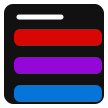

    
# ZoDo

v1.0

📝 [ZoDo]('') is an advanced and open-source todo list.

It is a dynamic single paged todo list built using React-js.

Feel free to fork it for your own use, especially if you want to add a webserver to make it sync all of your events. ;-)

## Roadmap

- Design a proper UI for desktop.

- Add desktop support.

- Add phablet ,tablet, and iPad support using the pages folder.

  
## Authors

- [@zeiadHani](https://github.com/Zeiadhani)

  